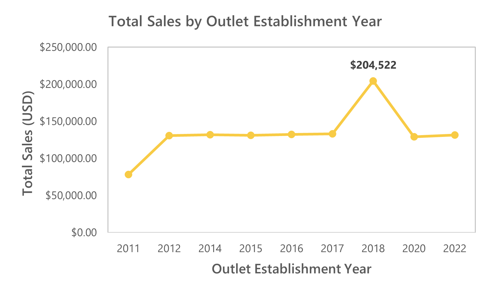
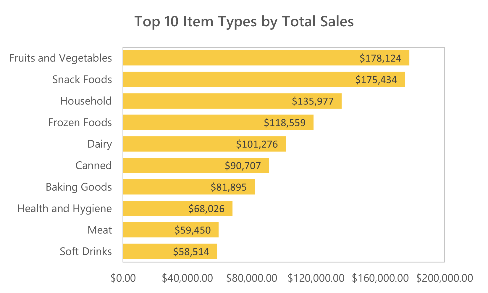
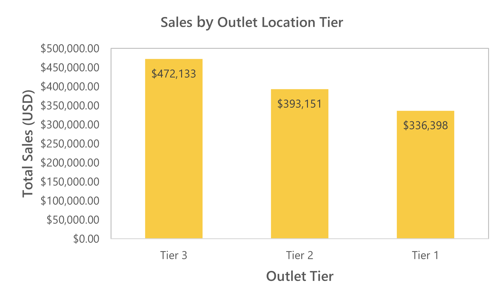

**TL;DR:** Built a Power BI revenue intelligence dashboard using 8,523 item-level records to diagnose outlet efficiency, category concentration, and geographic performance.  
Key findings: Tier 3 markets and medium-format outlets yield the strongest returns; Fruits & Vegetables and Snack Foods are core revenue anchors; the 2018 outlet cohort shows a repeatable expansion playbook.  
Strategic direction: shift from expansion-led growth to outlet-level optimization, category prioritization, and focused Tier 3 scaling.

# Blinkit Retail Performance & Revenue Analytics Dashboard

Built in Power BI | 8,523 records | Revenue intelligence case study

A strategic retail analytics case study built in Power BI using 8,523 item-level transaction records to evaluate revenue concentration, outlet efficiency, and geographic performance.

This project analyzes how sales are distributed across outlet formats, city tiers, and product categories to uncover structural growth drivers and operational gaps. The objective is not only to report performance, but to diagnose where capital, inventory, and expansion strategy should be prioritized.

The result is an executive-ready dashboard that translates raw retail data into actionable business insights focused on scalable growth, format optimization, and data-driven decision-making.

## Table of Contents

- [Project Background](#project-background)
- [Key Metrics](#key-metrics)
- [Data Overview & Validation](#data-overview--validation)
- [Executive Summary](#executive-summary)
- [Insights Deep Dive](#insights-deep-dive)
- [Strategic Recommendations](#strategic-recommendations--performance-metrics)
- [Assumptions & Limitations](#assumptions--limitations)
- [Next Steps](#next-steps)
  
## Project Background

Blinkit operates in a high-velocity quick-commerce environment where outlet performance, category mix, and geographic positioning directly influence revenue efficiency. As network scale increases, growth can no longer rely solely on footprint expansion. Leadership requires clarity on where revenue is truly coming from and which structural levers drive sustainable performance.

This case study analyzes 8,523 item-level sales records to evaluate outlet efficiency, product concentration, and regional revenue distribution. The objective is not just descriptive reporting, but strategic diagnosis.

The analysis focuses on three core business questions:

- Which outlet formats and city tiers generate the strongest revenue efficiency?
- Which product categories act as structural revenue anchors?
- Is growth driven by expansion volume, basket size, or format optimization?

The final output is an executive-ready Power BI dashboard designed to translate raw transactional data into performance signals and actionable growth strategy.

---

## Key Metrics

The dashboard evaluates retail performance across four dimensions:

**Revenue**
- Total Sales
- Average Sales per Record (AOV proxy)

**Category Performance**
- Revenue by Item Category
- Revenue Concentration Ratio

**Outlet Efficiency**
- Revenue by Outlet Type
- Revenue by Outlet Size
- Revenue by Establishment Year

**Geographic Distribution**
- Revenue by Tier (Tier 1 / 2 / 3)

These metrics provide a structured view of revenue concentration, operational efficiency, and scalable growth opportunities.

---

## Data Overview & Validation

**Source:** Blinkit Grocery Data.xlsx  
**Dataset Size:** 8,523 item-level retail records  

The dataset consists of a single denormalized transactional table containing both product attributes and outlet attributes. Each row represents item-level sales with associated store, category, and geographic information.

### Core Fields Used in Analysis

- `Item Type` – Product category  
- `Outlet Type` and `Outlet Size` – Store format classification  
- `Outlet Location Type` – Tier 1 / Tier 2 / Tier 3 segmentation  
- `Outlet Establishment Year` – Cohort reference  
- `Sales` – Revenue per record  
- `Rating` – Customer feedback proxy  

### Data Validation

Before building the dashboard, the dataset was reviewed to ensure:

- No missing values in revenue or key segmentation fields  
- Consistent labeling across outlet and category dimensions  
- Reliable aggregation for revenue calculations  

**Key Summary Metrics**

- Total Revenue: **$1,201,681.49**  
- Average Sales per Record: **$140.99**

No material data quality issues were identified that would impact revenue segmentation or performance analysis.

---

## Executive Summary

This analysis uncovers three structural revenue drivers for Blinkit:

- **Expansion cohort performance:** Outlets opened in 2018 show a distinct revenue spike. Newer cohorts stabilized rather than grew, which suggests earlier openings benefited from a high-efficiency rollout that is worth replicating.  
- **Category concentration:** Fruits & Vegetables and Snack Foods drive the bulk of revenue; several categories (Breakfast, Seafood) deliver low returns and should be tested or rationalized.  
- **Format and geography:** Tier 3 markets and medium-format outlets deliver the strongest revenue efficiency. Metro-first expansion is not always optimal.

Bottom line: prioritize outlet-level productivity, protect core categories, and scale medium-format outlets in high-performing Tier 3 clusters.
---

# Insights Deep Dive

## 1. The 2018 Expansion Efficiency Spike

**Figure 1.** Total sales by outlet establishment year.  
Outlets opened in 2018 demonstrate a clear revenue spike, after which cohort performance stabilizes.

Revenue by establishment cohort reveals a pronounced spike for outlets opened in 2018. Subsequent cohorts stabilize within a narrow revenue band, and earlier cohorts do not replicate this uplift.

This pattern signals a one-time expansion efficiency peak rather than steady structural growth.

The 2018 cohort likely benefited from:
- Optimized site selection
- Stronger launch execution
- Higher-demand catchment areas
- More effective assortment alignment

The absence of similar performance in later cohorts suggests that expansion alone is no longer the growth engine.

**Strategic Interpretation**

Blinkit’s next phase cannot rely on store count growth. It must focus on outlet-level productivity.

**Action Direction**

- Conduct a cohort analysis of 2018 outlets to identify repeatable success drivers  
- Benchmark newer outlets against 2018 performance metrics  
- Pilot operational replication before further geographic scaling  

---

## 2. Volume, Not Basket Size, Drove Growth

**Figure 2.** Average sales per record (AOV proxy) by establishment year.  
Basket size remains stable across cohorts, indicating that revenue growth in 2018 was volume-driven rather than pricing-driven.

Average sales per record remain consistently clustered around ~$140 across all cohorts. No meaningful spike accompanies the 2018 revenue jump.

This confirms that revenue growth in 2018 was driven by higher order volume, not larger basket size.

The implication is critical: price or basket expansion strategies will likely yield limited upside.

**Strategic Interpretation**

Demand generation, not basket expansion, is the dominant growth lever.

**Action Direction**

- Track Orders per Outlet as a primary performance metric  
- Run localized acquisition experiments in underperforming outlets  
- Focus on frequency growth rather than price optimization  

---

## 3. Revenue Concentration in Core Categories

**Figure 3.** Top 10 item categories by total revenue.

Revenue distribution across categories is highly concentrated. Fruits & Vegetables and Snack Foods form the structural revenue base, followed by Household and Frozen Foods.

Meanwhile, categories such as Breakfast and Seafood contribute disproportionately low revenue relative to assortment breadth.

Three structural dynamics emerge:

**Core Essentials Dependence**  
Daily consumption items anchor consistent revenue.

**Impulse Margin Opportunity**  
Snack Foods indicate strong impulse-driven purchasing behavior.

**Long-Tail Dilution Risk**  
Low-performing categories consume working capital and shelf allocation without proportional returns.

**Strategic Interpretation**

Revenue stability depends on protecting high-frequency anchors while managing long-tail inefficiency.

**Action Direction**

- Enforce zero-stockout tolerance for top SKUs  
- Reallocate promotional spend toward core categories  
- Run controlled pilots before scaling underperforming categories  
- Rationalize persistently low-yield SKUs  

---

## 4. Tier 3 as the Primary Growth Engine

**Figure 4.** Total revenue by outlet location tier.  
Tier 3 markets generate the highest aggregate revenue, outperforming Tier 1 and Tier 2 locations.

This contradicts the traditional assumption that metropolitan markets drive retail dominance.

Secondary markets appear to deliver stronger revenue density relative to competitive intensity.

**Strategic Interpretation**

Blinkit’s growth model favors underserved markets rather than saturated metros.

**Action Direction**

- Prioritize Tier 3 expansion clusters  
- Tailor assortment to Tier 3 consumption patterns  
- Evaluate Tier-level revenue per outlet before allocating metro capital  

---

## 5. The Medium-Format Efficiency Model

**Figure 5.** Revenue share by outlet size.  
Medium-sized outlets deliver the strongest revenue performance relative to footprint.

Medium-sized outlets contribute the highest revenue share (~42%), outperforming both small and large formats.

Large outlets do not demonstrate a proportional revenue advantage relative to operational footprint.

This suggests an optimal scale threshold.

**Strategic Interpretation**

Medium format represents Blinkit’s most capital-efficient store model.

**Action Direction**

- Standardize medium-format design for new openings  
- Audit large stores for operational inefficiencies  
- Measure revenue per square-foot equivalent where possible  

---

## 6. Health Preference as a Demand Signal

**Figure 6.** Revenue distribution by item fat content.  
Low-fat items significantly outperform regular-fat alternatives, indicating a strong health preference signal.

Low-fat items significantly outperform regular-fat alternatives, indicating a measurable consumer health preference within the dataset.

This is not a marginal signal. It reflects structural demand behavior.

**Strategic Interpretation**

Health-forward positioning can become a differentiated growth lever.

**Action Direction**

- Introduce a curated “Health Essentials” segment  
- Develop private-label low-fat SKUs  
- Bundle health-oriented impulse combinations  
- Track category-level margin expansion  

### Summary of Insights

1. Expansion efficiency peaked and has since normalized  
2. Revenue is highly concentrated in specific categories and formats  
3. Medium-format stores in Tier 3 markets offer the strongest scalable model  

Blinkit’s next growth chapter should prioritize operational precision over footprint acceleration.

---

# Strategic Recommendations & Performance Metrics

Based on the analysis, Blinkit appears to be transitioning from expansion-led growth to efficiency-led optimization. The following strategic initiatives are directly aligned with measurable performance indicators to ensure execution accountability.

---

## 1. Standardize the Medium-Format + Tier 3 Growth Model

Medium-sized outlets contribute the highest share of total revenue (~42%), while Tier 3 markets outperform Tier 1 and Tier 2 in aggregate sales. This combination represents Blinkit’s most capital-efficient expansion strategy.

Rather than expanding indiscriminately across geographies and formats, growth should prioritize replicating medium-format outlets within high-performing Tier 3 clusters. This aligns capital deployment with demonstrated revenue efficiency instead of assumption-driven metro expansion.

### KPIs to Track

- **Revenue per Outlet (Tier-Level Adjusted)**
- **Orders per Outlet (Tier 3 vs Tier 1 Comparison)**
- **New Outlet Payback Period**

**Success Target:**  
Achieve a 10–15% uplift in Orders per Outlet in pilot Tier 3 markets within 90 days of implementation.

---

## 2. Protect and Scale Core Revenue Categories

Fruits & Vegetables and Snack Foods function as structural revenue anchors. Revenue concentration within these categories indicates they stabilize overall platform performance.

Operational focus should prioritize zero-stockout tolerance, high in-app visibility, and improved replenishment forecasting for high-frequency SKUs.

### KPIs to Track

- **Stockout Rate for Top 20 SKUs**
- **Category Revenue Concentration Ratio (Top 3 Categories / Total Revenue)**
- **Weekly Sales Volatility of Core Categories**

**Success Target:**  
Maintain stockout rate below 3% for top SKUs while increasing category-level revenue consistency.

---

## 3. Shift from Expansion-Led Growth to Order-Volume Optimization

The 2018 revenue spike was driven by order volume rather than basket size. Average sales per record remain stable across outlet cohorts, indicating limited short-term leverage from pricing strategies alone.

Future growth should therefore focus on increasing order frequency and outlet-level productivity.

### KPIs to Track

- **Orders per Outlet**
- **Weekly Order Growth Rate**
- **Customer Acquisition Cost (Post-Instrumentation)**

**Success Target:**  
Sustain a 10–15% increase in outlet-level order volume without margin deterioration.

---

## 4. Implement Structured Category Experimentation

Underperforming categories such as Breakfast and Seafood represent controlled experimentation opportunities rather than immediate scaling candidates.

Capital allocation decisions should be driven by measurable pilot performance rather than shelf expansion assumptions.

### KPIs to Track

- **Incremental Category Sales Lift (Pilot vs Control)**
- **Revenue per SKU**
- **Category Contribution Margin (Future Instrumentation)**

**Success Target:**  
Scale only those categories demonstrating statistically meaningful incremental lift.

---

## 5. Upgrade Data Infrastructure for Long-Term Strategic Control

The current dataset lacks customer identifiers, transaction timestamps, and refund indicators. Without these, retention analysis, cohort modeling, and margin leakage detection remain constrained.

Enhancing data instrumentation is critical for long-term operational maturity.

### KPIs to Enable (Post-Instrumentation)

- **Repeat Purchase Rate**
- **Customer Lifetime Value (CLV)**
- **Refund Rate by SKU and Outlet**
- **Cohort Retention Curves**

**Success Target:**  
Establish baseline retention metrics within one quarter of data instrumentation deployment.

---

## Tools & Methods

**Tools Used**
- Power BI (Data modeling & visualization)
- Excel (Data review & preprocessing)

**Analytical Techniques**
- Cohort analysis (Outlet establishment year)
- Category revenue decomposition
- Tier-based segmentation
- Outlet format efficiency comparison

---

# Assumptions & Limitations

This analysis is based on a denormalized, cross-sectional retail sales dataset. While `Outlet Establishment Year` is available, transaction-level timestamps are not included. As a result, longitudinal trend analysis, seasonality detection, and time-based cohort modeling could not be performed.

Customer-level identifiers are absent from the dataset. This limits the ability to measure retention, repeat purchase behavior, customer lifetime value, and acquisition efficiency. All insights therefore, focus on outlet-level and category-level performance rather than customer cohorts.

The dataset does not include refund, return, discount, or margin fields. Revenue figures are treated as gross sales. Net revenue, contribution margin, and profitability analysis would require additional financial instrumentation.

Sales values are assumed to represent final transaction amounts in USD, without adjustments for tax, shipping, or promotional subsidies.

Minor categorical inconsistencies (e.g., variations in fat content labels) were standardized where possible. Further normalization would improve segmentation precision in a production environment.

Despite these constraints, the dataset is sufficient for revenue segmentation, outlet efficiency analysis, and strategic format optimization insights.

---

## Next Steps

To evolve this dashboard into a production-grade analytics framework:

- Introduce transaction-level fields (`transaction_date`, `order_id`, `customer_id`) to enable time-series and cohort analysis.
- Track weekly KPIs with automated performance alerts.
- Run structured A/B tests on underperforming categories.
- Implement a star schema model for scalable reporting.
- Build retention and repeat-purchase dashboards once customer-level data becomes available.
